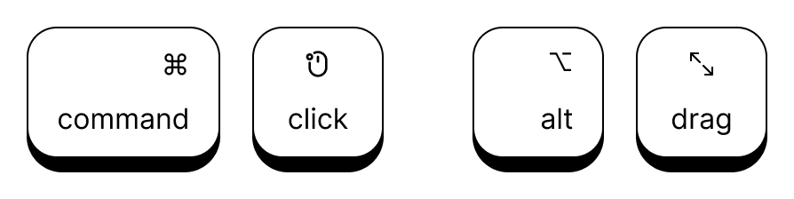
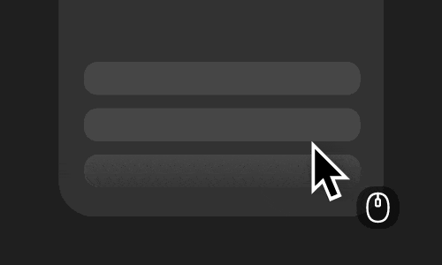
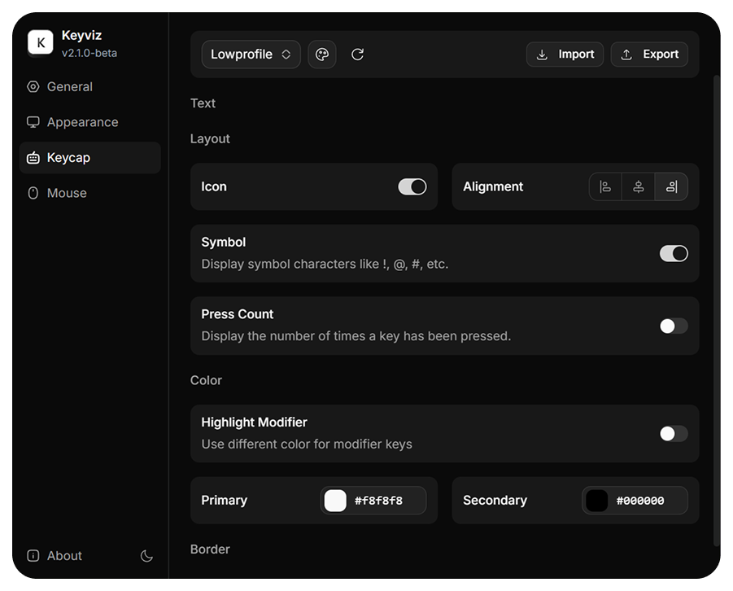

# [Keyviz](https://keyviz.org)


Keyviz is a **free and open-source** tool that visualizes your keypresses and mouse actions in real-time. Let your audience know what handy shortcuts you're pressing during tutorials, presentations, collaborations, or whenever you need.


## ⌨️ Keypress & 🖱️ Mouse Actions
Along with normal keys, can also visualize mouse actions like <kbd>Cmd</kbd> + <kbd>Click</kbd>, <kbd>Alt</kbd> + <kbd>Drag</kbd>, etc.



Display mouse clicks and scroll wheel movements alongside your cursor.



</br>

## ⚙️ Full Customization
Don't settle for defaults. Every aspect of the visualization is under your control:
- **Styling:** Change colors (modifier vs. regular keys), size, border radius, and icons.
- **Filtering:** Control which keys are shown using hotkeys or custom filters.
- **History:** Keep a visual trail of your recent inputs.
- **Position:** Move the visualization to any part of your screen.
- **Animations:** Customize how inputs appear and disappear with preset entry and exit animations.

</br>



</br>

## 📥 Installation

### Windows & macOS
You can download the latest version of Keyviz from the **[GitHub Releases](https://github.com/mulaRahul/keyviz/releases)** page.

*   **Windows:** Download the `.msi` installer, run it, and follow the steps.
*   **macOS:** Download the `.dmg`. 
    **Note:** Keyviz requires **Input Monitoring** and **Accessibility** permissions. Enable them here:
    `Settings > Privacy & Security > Input Monitoring & Accessibility`

### Linux (x11)
Keyviz is compatible with Linux using the X11 protocol. Currently, you can try it out by following the build instructions below.

</br>

## 🛠️ Build Instructions

If you want to contribute or build the latest features from the source, ensure you have [Node.js](https://nodejs.org/) and [Tauri](https://v2.tauri.app/start) set up on your system.

1.  **Clone the repository:**
    ```bash
    git clone https://github.com/mulaRahul/keyviz.git
    cd keyviz
    ```

2.  **Install dependencies:**
    ```bash
    npm install
    ```

3.  **Build the executable:**
    ```bash
    npx tauri build
    ```

<br/>


## 💖 Support the Project

*   **Star the Repo:** It helps others discover the project!
*   **GitHub Sponsors:** [Sponsor @mularahul](https://github.com/sponsors/mulaRahul)
*   **Keyviz Pro:** Get access to exclusive features while supporting the development of this open-source project.

👉 **[Upgrade to Pro at keyviz.org/pro](https://keyviz.org/pro)**

</br>

---

  Built with 🦀 and ❤️ using <a href="https://v2.tauri.app/">Tauri</a>.